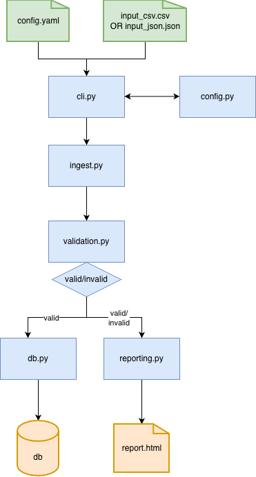

## Data Ingestion Service
Production-ready data validation and ingestion pipeline.

## What This Does
Validates and loads transaction data (CSV/JSON) into SQLite with configurable 
business rules. Catches data quality issues (negative amounts, future dates, 
nulls) and generates HTML reports showing what passed/failed and why.

## Features
- Schema validation with configurable rules
- CSV and JSON support
- SQLite database with upsert logic
- HTML data quality reports
- CLI interface
- YAML configuration

## Quick Start
```bash
# Install UV
curl -LsSf https://astral.sh/uv/install.sh | sh

# Clone and setup
git clone 
cd data-ingestion-service
uv sync

# Run demo
uv run python demo.py
```

Takes ~2 minutes. Opens HTML report showing validation in action.

## Setup
```bash
uv sync
```

## Usage
Run ingestion on a CSV or JSON file:
```bash
uv run python -m ingestion --input data/transactions.csv
```

With custom database path:
```bash
uv run python -m ingestion --input data/transactions.json --db output.db
```

See all options:
```bash
uv run python -m ingestion --help
```

## Configuration
Edit `config.yaml` to customize settings:
```yaml
database:
  path: "data/transactions.db"  # Change this to your desired path
```

Save the file and run the pipeline. Changes take effect immediately.

## Project Structure
<pre>
data-ingestion-service/
├── src/
    └── ingestion/
        ├── cli.py
        ├── config.py
        ├── db.py
        ├── ingest.py
        ├── models.py
        ├── reporting.py
        └── validation.py
├── tests/
    ├── conftest.py
    ├── test_cli.py
    ├── test_db.py
    ├── test_ingest.py
    ├── test_reporting.py
    └── test_validation.py
├── data/
├── reports/
├── config.yaml
├── pyproject.toml
└── README.md
</pre>

## Architecture


## Demo
```bash
uv run python demo.py
```